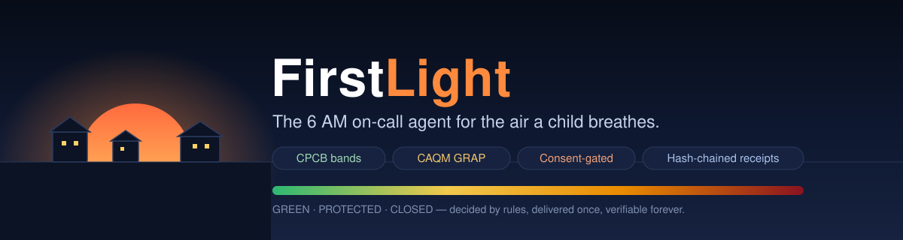
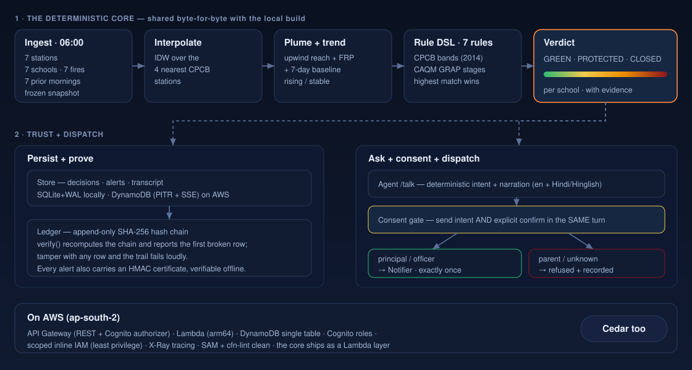
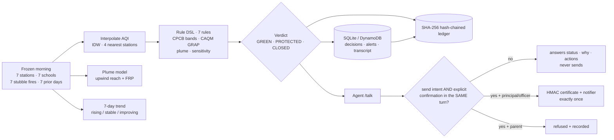

**The 6 AM on-call agent for the air a child breathes — it gives every school its answer before a single bell rings, and it ships the receipts.**

> **Track:** Air · **Path:** Build It + Ship It (both live).
> **Ship It is deployed:** the console and every API run on Lambda + API Gateway
> + DynamoDB + Cognito in `ap-south-2` — **[open the live console](https://8s2dtqrqzi.execute-api.ap-south-2.amazonaws.com/dev/)**.
> The **Build It** path (FastAPI + SQLite) is the zero-dependency replay: no
> account, no network, no card, two minutes. AWS **Cedar** open-source policies
> encode the role matrix in both. Every verdict is produced by the *same*
> deterministic engine — the core ships as a Lambda layer, and a test asserts the
> cloud answer is byte-for-byte the local one.

[](https://github.com/ionfwsrijan/FirstLight/actions/workflows/ci.yml)
[](LICENSE)
[](pyproject.toml)
[](tests/)
[](pyproject.toml)
[](docs/architecture.md)

**Live console:** <https://8s2dtqrqzi.execute-api.ap-south-2.amazonaws.com/dev/> · **Architecture:** [docs/architecture.md](docs/architecture.md) · **Real vs simulated:** [docs/LEARNINGS.md](docs/LEARNINGS.md) · **Submission map:** [docs/submission.md](docs/submission.md) · **Ship It runbook:** [sam/README.md](sam/README.md) · **Try it locally:** `make setup && make serve`

It is 6 AM in Delhi in early November. The air is 427 on the CPCB scale at
Anand Vihar and there are six stubble fires upwind in Punjab. Nobody has called
anyone yet. FirstLight has already interpolated every school's air from the
nearest stations, scored the plume against the wind, read the seven-day trend,
and run the whole thing through the published rules — **CPCB bands and the CAQM
GRAP stages** — for all seven schools at once. One school reads **CLOSED**
(Severe, GRAP Stage 3, active plume). Another, calmer, reads **PROTECTED**
(masks for sensitive kids, no outdoor PE). Each verdict arrives with its
evidence trail and the one list of actions the *rules* allow. A principal can
confirm — and the alert goes out exactly once, signed, and written into a
hash-chained ledger. A parent asking the same question gets the status and is
told, honestly, that only a principal or officer can dispatch.

Nothing here depends on a model making the call. The class of 2026 does not get
its school day decided by a coin toss or a temperature setting. The rules
decide; the ledger proves it. The safety property is ordinary, deterministic
code — tested **132 times**.



## Try it in two minutes, no AWS account

```bash
make setup            # create the venv, install the package + dev deps
make serve            # console + FastAPI at http://127.0.0.1:8000
```

Open <http://127.0.0.1:8000>, sign in as any persona, and read the morning. The
console shows each school's verdict, the band and GRAP stage behind it, the
applied rules, and the plume. Ask the agent about a school: it answers with the
decision — and never sends on its own. Say `yes, send it` as a **parent** and it
is refused, because only a principal or officer may dispatch. Sign in as the
principal, confirm the same way, and the alert fires once, with a signed
certificate, a receipt, and a new ledger row — all visible in the console.

Every call is the production code path. Only the weather (a frozen 05:30 IST
snapshot), the store (SQLite under `data/`) and the delivery channel (the
console notifier) are local stand-ins. No secrets, no network, no API key, no
frontend build.

---

## What it does, in one cold morning



<details open>
<summary>Architecture (Mermaid — renders on GitHub)</summary>



</details>

```
06:00 ──► morning_inputs()          # frozen snapshot: 7 stations · 7 schools · 7 fires · 7 mornings
      ──► interpolate(stations)     # IDW over the 4 nearest stations
      ──► plume(fires, wind)        # upwind reach (500 km) + FRP
      ──► trend(history)            # 7-day median baseline → rising / stable / improving
      ──► evaluate(rules)           # 7-rule DSL → CPCB band · GRAP stage · verdict
      ──► persist + ledger.append() # append-only SHA-256 hash chain
      ──► [ the same package as a Lambda layer ]   # cloud == local, asserted
```

## Where AWS fits

| Service / AWS open source | Role | Where |
|---|---|---|
| **AWS Lambda** (arm64, python3.12) + **API Gateway** (REST + Cognito authorizer) | serve the very same console and the `morning / talk / meta` APIs | `sam/handlers/`, `sam/template.yaml` |
| **The core as a Lambda layer** | the pure-Python engine, DSL, ledger and agent, shared byte-for-byte with the local build | `firstlight/`, `sam/build_layer.py` |
| **Amazon DynamoDB** (single table, on-demand, PITR + SSE) | decisions, alerts, the hash-chained ledger, agent transcript, outbox | `sam/handlers/shared.py` |
| **Amazon Cognito** | the parent / principal / officer roles and the ID tokens the gateway trusts | `sam/template.yaml` |
| **AWS IAM** (scoped inline policies) | least privilege per function: Dynamo read vs read/write, Cognito auth only — no broad managed policies | `sam/template.yaml` |
| **AWS Cedar** (AWS open source) | the allow/forbid role matrix, shipped in the local build too | `firstlight/auth/cedar/policies.cedar` |
| **AWS SAM CLI** (AWS open source) | build + deploy; `cfn-lint` and `sam validate` run in CI | `sam/template.yaml`, `.github/workflows/ci.yml` |

The live stack is up in `ap-south-2`. There is no foundation model anywhere in
the decision or reply path — the "agent" is deterministic
(`firstlight/agent/`), and that is a deliberate safety property, not a missing
feature: the verdict is auditable, not sampled.

## The rules are the policy (the part that matters)

A school-day decision is only worth shipping if you can show *who decided, why,
and that it happened*. FirstLight's controls are in code, not in a prompt:

1. **The engine decides.** Band thresholds come from the **CPCB National AQI
   (2014)**; escalation from the **CAQM GRAP** stages. A 7-rule DSL evaluates
   the morning and the highest-severity match wins. No prompt, model or coin
   toss produces a verdict.
2. **Stricter wins.** GRAP Stage IV (AQI ≥ 450) forces CLOSED even inside the
   Severe band; a Very-Poor school with an active stubble plume closes where the
   same AQI without a plume would only protect.
3. **Consent is exact — and role-bound.** A send requires the *send intent* **and**
   an explicit confirmation in the **same turn**. `is my school closed?`,
   `maybe send later` and a recall never dispatch. A `parent` who confirms is
   refused and the refusal is recorded; only a `principal` or `officer` sends.
4. **Executes once, then proves it.** The alert is delivered a single time, its
   HMAC certificate is verifying-able offline, and the decision, alert and agent
   turns are appended to a **SHA-256 hash chain**. `verify()` recomputes the
   chain and reports the first broken row — tamper with any row and the trail
   fails loudly.
5. **Every constant cites a source.** The bands and GRAP triggers trace to CPCB
   and CAQM; the three honest caveats are in
   [`docs/LEARNINGS.md`](docs/LEARNINGS.md).
6. **Determinism is a test.** Repeated runs produce byte-identical decision
   payloads, and the AWS twin is asserted equal to the local build
   ([`tests/test_sam_mirror.py`](tests/test_sam_mirror.py)).
7. **Roles fail closed.** Every call checks the token and the Cedar matrix; 401,
   403 and 404 are all covered by tests, and the public surface is exactly
   `/health`, `/login` and `/`.

## Run it

### Locally, no AWS account

```bash
make setup            # create .venv, install the package + dev deps
make serve            # console at http://127.0.0.1:8000
make test             # 132 tests; coverage floor 85%
make lint             # ruff + mypy (clean)
```

Or without Make:

```bash
py -m firstlight.cli seed && py -m firstlight.cli serve
```

The deterministic replay uses the exact station/feed shape, so the morning the
demo shows replays identically in the room.

### On AWS (the _ship it_ path — deployed)

```bash
python sam/build_layer.py                 # cross-platform: pack the core into a Lambda layer
sam build --template sam/template.yaml
sam deploy --stack-name firstlight-shipit --region ap-south-2 \
  --capabilities CAPABILITY_IAM --no-confirm-changeset --resolve-s3 \
  --parameter-overrides Env=dev
```

Outputs: **`ApiUrl`** (the live console), `UserPoolId`, `UserPoolClientId`,
`TableName`. Two caveats, stated honestly:

- **Reserved concurrency is off.** On a brand-new account the Lambda
  concurrency quota is too low to reserve safely, so the functions run
  unreserved. Everything else (scoped IAM, PITR + SSE, active tracing) is on.
- **Stations and wind are frozen;** only the fires are live (NASA FIRMS with a
  visible fallback). A full feed is a swap of one fetcher — see
  [`docs/LEARNINGS.md`](docs/LEARNINGS.md).

Runbook and least-privilege IAM notes: [`sam/README.md`](sam/README.md).

## Repository map

```
firstlight/
  domain/         Level/Trend, Station, School, StubbleFire, Wind, RuleHit, Decision
  engine/         CPCB bands + CAQM GRAP, haversine/bearing, IDW interpolation,
                  stubble-plume model, 7-day trend, decision orchestration
  dsl/            data-driven rule chain, evaluated like a tiny language (7 rules)
  ledger/store.py append-only hash-chained event ledger + verify()
  auth/           HMAC capability tokens, seeded pbkdf2-sha256 login, role matrix, Cedar policies
  agent/          intents (en + Hindi/Hinglish), narrator, consent gate, certificate signing
  notifier/       console / silent / SMTP / webhook dispatch abstraction (returns a receipt)
  storage/        SQLite (WAL) schema + repositories: stations, schools, fires, history,
                  decisions, alerts, users, agent transcript, provenance
  pipeline/       morning run, live fire refresh (NASA FIRMS), provenance
  api/            FastAPI app: /api/health, /login, /schools, /decisions, /agent/talk, /ledger, ledger UI
web/index.html    single-file, zero-build console (served identically by the twin)
sam/              template.yaml · handlers/ (6 Lambdas) · build_layer.py · static/index.py
docs/             architecture.md · LEARNINGS.md · submission.md · demo-script.md
tests/            132 tests: bands, geometry, interpolation, plume, trend, DSL, ledger tamper,
                  consent, tokens, roles, API, pipeline, FIRMS parsing, notifier, SAM-mirror
```

## Development

```bash
make help             # every target, one line each
make test             # full gate (132 tests) + coverage
make lint             # ruff check + mypy
cfn-lint sam/template.yaml
sam validate --template sam/template.yaml --lint
```

Tests are the spec. The safety model is asserted directly: one test per consent
and intent variant ([`tests/test_agent.py`](tests/test_agent.py)), the
stricter-wins band/GRAP merge ([`tests/test_bands.py`](tests/test_bands.py)),
the hash-chain tamper detector ([`tests/test_ledger.py`](tests/test_ledger.py)),
the cloud-equals-local mirror ([`tests/test_sam_mirror.py`](tests/test_sam_mirror.py)),
and the notifier receipts ([`tests/test_notifier.py`](tests/test_notifier.py)).
CI runs the full gate, `cfn-lint`, `sam validate`, and a console
single-source drift check on every push to `main`.

## Production notes

What "production-minded" means here, and where each claim is enforced:

| Concern | Where |
|---|---|
| Least privilege: Dynamo read vs read/write, Cognito auth only — composed per function, no managed policies | `sam/template.yaml`; `cfn-lint` clean in CI |
| Consent fails closed: send intent + explicit confirm in the SAME turn; a parent's dispatch is refused | `firstlight/agent/consent.py`, `tests/test_agent.py`, `tests/test_sam_mirror.py` |
| One record per fact: decisions, alerts and transcript rows are appended to a hash chain; `verify()` reports the first broken row | `firstlight/ledger/store.py`, `sam/handlers/shared.py`, `tests/test_ledger.py` |
| Determinism: repeat runs are byte-identical, and the AWS verdict equals the local verdict | `tests/test_engine.py`, `tests/test_pipeline.py`, `tests/test_sam_mirror.py` |
| Notifier failures are logged and never take the morning down (a receipt or a `-failed` string) | `firstlight/notifier/__init__.py`, `tests/test_notifier.py` |
| The morning is idempotent per school+date (upsert), committed atomically after the ledger append | `firstlight/pipeline/morning.py`, `firstlight/storage/repositories.py` |
| Live fire refresh is officer-only; provenance (source, time, count, fallback) is persisted and labelled | `firstlight/pipeline/sources.py`, `tests/test_sources.py` |
| AWS resources: DynamoDB `PAY_PER_REQUEST` + PITR + SSE; arm64 Lambdas; active X-Ray tracing | `sam/template.yaml` |
| The console is one file, no build; the served copy is checked for drift in CI | `web/index.html`, `sam/static/index.html`, `sam/build_layer.py --check` |

Known gaps, on purpose for a hackathon: a dev-only default secret instead of a
real secret manager (inject `FIRSTLIGHT_SECRET` in prod); the demo's stations,
wind and history stay frozen (only the fires are live); and the notifier
delivers a receipt, not a real call tree. All of it, with the CPCB/CAQM
citations, is in [`docs/LEARNINGS.md`](docs/LEARNINGS.md).

## License

MIT. This is a hackathon build; the physics and policy citations live in the code.
