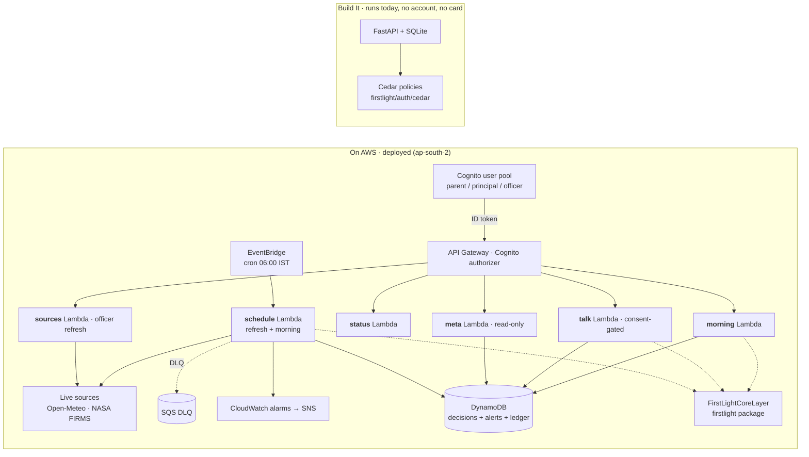

# FirstLight architecture

The 6 AM decision — one school, one morning, one answer — with receipts.

```mermaid
flowchart TD
    subgraph In["Frozen morning · 06:00 (Build It)"]
        A[ingest snapshot<br/>7 stations · 7 schools · 7 stubble fires · 7 prior mornings] --> B[pipeline/morning.py]
    end

    subgraph Decide["Deterministic decision core"]
        B --> C[interpolate AQI<br/>IDW · 4 nearest stations ≤ 40 km]
        B --> D[stubble plume model<br/>reach 500 km · wind alignment · FRP]
        B --> E[7-day trend<br/>median baseline · Δ and Δfrac]
        C --> F[rule DSL · 7 rules<br/>CPCB bands · GRAP stages · plume · sensitivity]
        D --> F
        E --> F
        F --> G[per-school verdict<br/>GREEN · PROTECTED · CLOSED]
    end

    subgraph Persist["Trust layer"]
        G --> H[SQLite WAL<br/>decisions + history_aqi]
        G --> L[hash-chained ledger<br/>decision + alert + cert rows]
        H --> L
        L --> Z[ledger verify&#40;&#41; must pass<br/>else nothing is shown as authentic]
    end

    subgraph Consume["The call, not a dashboard"]
        G --> T[FastAPI /api/agent/talk]
        T --> I[consent gate<br/>send intent + explicit confirm in SAME turn]
        I -- no --> N[renders status · why · actions - never sends]
        I -- yes --> C2[HMAC-signed certificate<br/>verifyable later offline]
        C2 --> O[notifier · console / SMTP / webhook]
    end
```

## Ship It twin (identical engine, AWS-shaped)

The local Build It app is the product. `sam/template.yaml` redeploys the same
pure-Python core (engine, DSL, ledger semantics) as a Lambda layer with
AWS-native plumbing around it, so the cloud verdict is byte-for-byte the same
as the local verdict:

Authorization is AWS **Cedar** (genuine AWS OSS) in
[`firstlight/auth/cedar/policies.cedar`](../firstlight/auth/cedar/policies.cedar),
and the same allow/forbid matrix ships in the local role model.

## The two hard rules

1. **The engine decides.** No prompt, model, or coin toss produces a verdict;
   the agent only narrates the engine's output.
2. **No action without consent.** Sending requires the send intent **and** an
   explicit confirmation phrase in the same turn.
3. **Everything is provable later.** Every decision and alert is chained in a
   hash ledger and every alert carries an HMAC certificate.